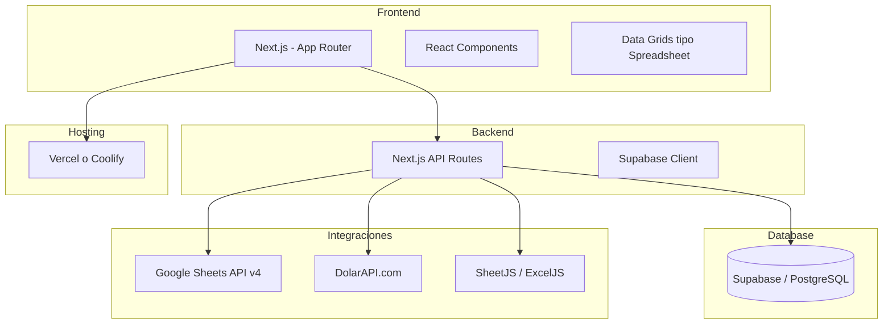

# Decisión de Arquitectura — Sistema de Logística Internacional

> **Versión**: 1.0 · **Fecha**: 2026-02-24

---

## 1. Opciones en la Mesa

### Opción A: Pure Google Sheets + Apps Script

| | |
|---|---|
| **Qué es** | Todo vive en un Google Spreadsheet. La lógica se programa en Apps Script |
| **✅ Pros** | Familiar para el usuario · Sin hosting · Sin costo |
| **❌ Contras** | UI limitada · Frágil a escala · Apps Script tiene límite de 6min/ejecución · No se puede asistir con IA fácilmente · Importar Excel requiere workarounds · Dashboards rudimentarios |
| **Veredicto** | Insuficiente para la complejidad requerida |

---

### Opción B: Web App + Mirror en Sheets ⭐ Recomendada

| | |
|---|---|
| **Qué es** | Web app como sistema principal (source of truth). Los datos se sincronizan a Google Sheets para consulta en un entorno familiar |
| **✅ Pros** | Control total · Desarrollo asistido por IA (Antigravity/Claude Code) · UI profesional · Sheets como capa de "confort" para usuarios · Escalable |
| **❌ Contras** | Requiere hosting · Más complejidad inicial · Dos sistemas que mantener sincronizados |
| **Veredicto** | **Mejor balance** entre control técnico y usabilidad |

---

### Opción C: Pure Web App (sin Sheets)

| | |
|---|---|
| **Qué es** | Todo en la web app. Sheets queda solo como formato de exportación (.xlsx) |
| **✅ Pros** | Arquitectura limpia · Un solo sistema · Desarrollo ágil |
| **❌ Contras** | Los usuarios pierden la posibilidad de ver datos en Sheets · Curva de aprendizaje mayor |
| **Veredicto** | Viable, pero pierde la familiaridad de Sheets |

---

## 2. Análisis del "Mirror" en Sheets

La pregunta clave es: **¿qué nivel de sincronización necesitás?**

### Tres niveles de mirror

| Nivel | Mecanismo | Frescura | Complejidad | Costo API |
|---|---|---|---|---|
| 🔴 **Real-time** | Cada cambio en la app se escribe a Sheets al instante | Inmediato | Alta | ~Alto (rate limits: 100 req/100s) |
| 🟡 **On-demand** | Botón "Sincronizar a Sheets" en la app | Cuando el usuario quiere | Media | Bajo |
| 🟢 **Export only** | Botón "Descargar Excel" — no hay Sheet permanente | Cuando descarga | Baja | Cero |

### Recomendación: 🟡 On-demand + 🟢 Export

```
┌──────────────────────┐          ┌─────────────────────┐
│      WEB APP         │  sync    │   GOOGLE SHEETS     │
│   (Source of truth)  │────────▶ │  (Mirror read-only) │
│                      │  botón   │                     │
│  Contenedores        │          │  Tab: Contenedores  │
│  Packing Lists       │          │  Tab: Packing Lists │
│  Clientes            │          │  Tab: Clientes      │
│  Costos              │          │  Tab: Costos        │
└──────────┬───────────┘          └─────────────────────┘
           │
           │ descargar
           ▼
      📄 archivo.xlsx
```

**¿Por qué no real-time?**
- Google Sheets API tiene rate limits estrictos
- Para 1-3 usuarios, la frescura inmediata no aporta valor real
- La complejidad de manejar conflictos y errores de sync no justifica el beneficio
- El botón "Sincronizar" es más predecible y confiable

**¿Qué se sincronizaría a Sheets?**
- Listado de contenedores activos (con estado, ETD, ETA)
- Packing list de un contenedor seleccionado
- Resumen por cliente
- Costos por contenedor

> [!IMPORTANT]
> El Google Sheet sería **read-only** para el usuario. Toda edición se hace en la web app. El Sheet es solo una "ventana" de datos en un formato familiar.

---

## 3. Stack Técnico Recomendado



| Componente | Tecnología | Justificación |
|---|---|---|
| **Framework** | Next.js (App Router) | SSR, API routes integradas, excelente DX, AI-assistable |
| **UI** | React + componentes con grillas tabulares | Familiaridad visual tipo spreadsheet |
| **Base de datos** | Supabase (PostgreSQL) | Free tier generoso, auth, real-time, ya tenés MCP configurado |
| **Hosting** | Vercel (free tier) o Coolify | Vercel tiene integración nativa con Next.js; Coolify si preferís self-hosted |
| **Sheets Mirror** | Google Sheets API v4 + Service Account | Sync on-demand, server-to-server sin OAuth del usuario |
| **Export Excel** | ExcelJS | Genera .xlsx formateados desde la app |
| **Tipo de cambio** | [DolarAPI.com](https://dolarapi.com) | API gratuita, sin auth, devuelve todos los tipos de dólar |
| **Estilo** | CSS vanilla o Tailwind | Según preferencia |

---

## 4. ¿Qué vería cada tipo de usuario?

### En la Web App (sistema principal)
- Crear/editar contenedores
- Importar packing lists (drag & drop Excel)
- Clasificar items (etiquetas, clientes)
- Calculadora de costos (doble salida)
- Cálculo volumétrico
- Dashboards interactivos
- Cambio de estado de contenedores
- Consulta por cliente / etiqueta
- Exportar a Excel

### En Google Sheets (mirror de lectura)
- Tab con contenedores activos
- Tab con packing lists
- Tab con resumen de clientes
- Tab con costos
- Datos actualizados cuando el operador pulsa "Sincronizar"
- Formatos familiares: filtros, colores, formato condicional

---

## 5. Decisiones que Necesito de Vos

| # | Pregunta | Opciones |
|---|---|---|
| 1 | **¿Confirmás la Opción B** (Web App + Sheets Mirror on-demand)? | Sí / No / Otra |
| 2 | **¿Hosting**: Vercel (free, managed) o Coolify (self-hosted)? | Vercel / Coolify |
| 3 | **¿Supabase como DB está bien?** Free tier: 500MB, 50K monthly active users | Sí / No |
| 4 | **¿El mirror a Sheets es imprescindible para v1** o puede ser una feature posterior? | v1 / Posterior |
| 5 | **¿Hay algún dominio/subdominio** donde se montaría la app? | Indicar |
| 6 | **¿Autenticación**: necesitás login (usuario/contraseña) o es una app interna sin auth? | Con auth / Sin auth |
