# Development Playbook — Logística Internacional

> Guía completa para desarrollo asistido por IA: features, skills, patterns, herramientas.

---

## 1. Feature Breakdown por Fase

Cada feature es una unidad de trabajo auto-contenida que puede completarse en 1-2 sesiones de IA.

---

### Phase 1: Foundation

#### F1.1 — Auth + Layout Base

| | |
|---|---|
| **Scope** | Login con Supabase Auth, layout con sidebar, header, breadcrumbs |
| **Datos** | Tabla `profiles` (extiende `auth.users`) |
| **Entregables** | Login page, layout persistente, protección de rutas |

**Pasos**:
1. Crear proyecto Supabase (dashboard manual)
2. Configurar `.env.local` con Supabase URL + Anon Key
3. Instalar `@supabase/ssr` (no `@supabase/auth-helpers` — deprecado)
4. Crear `src/lib/supabase/client.js` (browser) y `server.js` (server)
5. Crear middleware de auth (`middleware.js`)
6. Crear tabla `profiles` (migración SQL)
7. Crear `src/app/login/page.js` — email + password
8. Crear layout con sidebar responsive + header
9. Proteger todas las rutas excepto `/login`

**Criterios de aceptación**:
- [ ] Login funciona con email/password
- [ ] Rutas protegidas redirigen a `/login` si no autenticado
- [ ] Sidebar muestra navegación a todos los módulos (vacíos)
- [ ] Build sin errores

---

### Phase 2: Core

#### F2.1 — Gestión de Contenedores

| | |
|---|---|
| **Scope** | CRUD de contenedores, generación de código, flujo de estados |
| **Datos** | Tabla `containers`, `container_dimensions` |
| **Deps** | F1.1 (auth + layout) |

**Pasos**:
1. Crear migración: tablas `containers`, `container_dimensions` + seed dimensions
2. Crear `src/app/contenedores/page.js` — lista con filtros (estado, origen)
3. Crear `src/app/contenedores/nuevo/page.js` — formulario
4. Crear `src/app/contenedores/[id]/page.js` — detalle con tabs
5. Implementar generación auto de código (`HK-2026-001`)
6. Implementar flujo de estados con UI visual (badges, botones)
7. Server Actions para crear, editar, cambiar estado

**Criterios de aceptación**:
- [ ] Crear contenedor con todos los campos
- [ ] Código auto-generado correctamente
- [ ] Cambio de estado secuencial funciona
- [ ] Lista filtra por estado y origen

---

#### F2.2 — Importación de Packing Lists

| | |
|---|---|
| **Scope** | Parseo de Excel, preview, mapeo de columnas, asociación a contenedor |
| **Datos** | Tablas `packing_lists`, `packing_list_items` |
| **Deps** | F2.1 (contenedores) |
| **Libs** | `xlsx` (SheetJS) para parseo, `@tanstack/react-table` para tabla |

**Pasos**:
1. Instalar `xlsx` y `@tanstack/react-table`
2. Crear migración: tablas `packing_lists`, `packing_list_items`
3. Crear `PackingListImporter.js` — drag & drop + file input
4. Parsear Excel client-side con SheetJS
5. Mostrar preview + mapeo de columnas (auto-detectar donde sea posible)
6. Server Action para guardar items en DB
7. Crear `PackingListTable.js` — tabla tipo spreadsheet con items guardados

**Criterios de aceptación**:
- [ ] Drag & drop FileUpload funciona
- [ ] Excel se parsea y muestra preview correcto
- [ ] Mapeo de columnas permite asociar cada campo
- [ ] Items se guardan y se ven en tabla

---

#### F2.3 — Clientes + Etiquetas + Clasificación

| | |
|---|---|
| **Scope** | CRUD clientes, CRUD etiquetas, asignar ambos a items de packing list |
| **Datos** | Tablas `clients`, `client_rate_history`, `tags`, `item_tags` |
| **Deps** | F2.2 (packing list items existen) |

**Pasos**:
1. Crear migración: tablas `clients`, `client_rate_history`, `tags`, `item_tags`
2. Crear `src/app/clientes/page.js` — lista de clientes
3. Crear `src/app/clientes/[id]/page.js` — ficha con histórico
4. Crear `src/app/etiquetas/page.js` — gestión con normalización
5. Crear `ItemClassifier.js` — UI para asignar etiquetas/clientes a items
6. Implementar sugerencias de etiquetas (fuzzy match contra maestro)
7. Trigger DB para registrar cambios de tarifa en `client_rate_history`

**Criterios de aceptación**:
- [ ] Crear/editar clientes y etiquetas
- [ ] Asignar cliente a items (individual y batch)
- [ ] Asignar etiquetas a items (múltiples)
- [ ] Etiquetas se normalizan y sugieren similares

---

### Phase 3: Calculators

#### F3.1 — Calculadora de Costos

| | |
|---|---|
| **Scope** | Matriz dinámica, doble salida, distribución por cliente |
| **Datos** | Tablas `cost_calculations`, `cost_items` |
| **Deps** | F2.1 (contenedores), F2.3 (clientes para distribución) |

**Pasos**:
1. Crear migración: tablas `cost_calculations`, `cost_items`
2. Crear `src/lib/calculadora/engine.js` — lógica pura de cálculo
3. Crear `src/lib/calculadora/defaults.js` — matriz default
4. Crear `src/hooks/useCostCalculator.js` — estado reactivo
5. Crear `CostMatrix.js` — UI con filas toggle-ables
6. Crear `CostOutput.js` — salida real (read-only)
7. Crear `CostOutputClient.js` — salida cliente (editable)
8. Implementar distribución por cliente (costo × vol_cliente/vol_total)
9. Server Action para guardar cálculo completo

**Criterios de aceptación**:
- [ ] Matriz carga defaults y permite toggle y edición
- [ ] Cálculos encadenados correctos (FOB → CIF → Base → Total)
- [ ] Salida cliente permite override independiente
- [ ] Distribución por cliente es proporcional a volumen
- [ ] Se puede agregar/quitar conceptos de costo

---

#### F3.2 — Volumétrica + Tipo de Cambio

| | |
|---|---|
| **Scope** | Calc volumétrico, API dólar, selector de tipo, historial |
| **Datos** | Tabla `exchange_rates`, ref. `container_dimensions` |
| **Deps** | F2.1 (container_dimensions) |

**Pasos**:
1. Crear migración: tabla `exchange_rates`
2. Crear `src/lib/calculadora/volumetric.js` — lógica de cálculo
3. Crear `VolumetricCalc.js` — UI con inputs y resultado visual
4. Crear `src/lib/exchange-rate.js` — fetch a DolarAPI.com
5. Crear `src/app/api/exchange-rate/route.js` — API proxy
6. Crear selector de tipo de dólar en la calculadora de costos
7. Registrar tipo de cambio utilizado en cada operación

**Criterios de aceptación**:
- [ ] Volumétrico calcula cajas correctas para los 3 tipos de container
- [ ] Validación de peso máximo funciona
- [ ] API de dólar devuelve tipos actualizados
- [ ] Tipo de cambio se registra con el contenedor

---

### Phase 4: Views & Export

#### F4.1 — Dashboards + Consultas + Export + Histórico

| | |
|---|---|
| **Scope** | 3 dashboards, consultas por cliente/etiqueta, export xlsx, histórico |
| **Deps** | Todas las fases anteriores |
| **Libs** | `exceljs` para export |

**Pasos**:
1. Instalar `exceljs`
2. Dashboard General: contenedores por estado, próximos ETAs
3. Dashboard Contenedores: lista filtrable con detalle rápido
4. Dashboard Clientes: indicadores + drill-down
5. Vista de consulta por cliente (contenedores, packing lists, costos)
6. Vista de consulta por etiqueta (contenedores, items, clientes)
7. `src/app/api/export/route.js` — genera .xlsx por contenedor o por cliente
8. `src/app/historico/page.js` — contenedores finalizados con filtros
9. ExportButton component reutilizable

**Criterios de aceptación**:
- [ ] Dashboards muestran datos reales con indicadores visuales
- [ ] Consulta por cliente muestra todo lo esperado
- [ ] Export genera .xlsx válido y abre en Excel correctamente
- [ ] Histórico muestra contenedores finalizados con filtros

---

## 2. Análisis de MCP y Herramientas

### MCPs Disponibles — ¿Cuáles usar?

| MCP Server | Usar | Herramientas necesarias | Justificación |
|---|---|---|---|
| **supabase-mcp-server** | ✅ Selectivo | `execute_sql`, `get_tables`, `get_table_schema`, `apply_migration` | Solo para operaciones de DB. NO usar para auth, storage, ni edge functions (se manejan desde código) |
| **github** | ❌ No | — | Ya usamos `gh` CLI. El MCP agrega contexto innecesario |
| **sequential-thinking** | ✅ Sí | Herramienta única | Útil para planificar features complejas antes de implementar |
| **Astro_docs** | ❌ No | — | Proyecto Next.js, no Astro |
| **coolify** | ❌ No | — | Deploy es en Vercel |
| **n8n-mcp** | ❌ No | — | No hay automaciones n8n en este proyecto |
| **sonar-bridge** | ⚠️ Opcional | Solo para auditoría | Útil para verificación de calidad, no para desarrollo diario |
| **sonatype-guide** | ❌ No | — | No aplica |

> [!IMPORTANT]
> **Regla de bloat**: Solo cargar los MCPs marcados ✅. Los ❌ agregan tokens de contexto innecesarios a cada interacción. Menos herramientas = más enfoque = mejor código.

### NPM Dependencies mínimas

| Paquete | Propósito | Cuándo instalar |
|---|---|---|
| `@supabase/ssr` | Auth + client Supabase | F1.1 |
| `xlsx` (SheetJS) | Parsear Excel packing lists | F2.2 |
| `@tanstack/react-table` | Tablas tipo spreadsheet | F2.2 |
| `zod` | Validación de inputs | F1.1 |
| `lucide-react` | Iconos | F1.1 |
| `exceljs` | Generar .xlsx export | F4.1 |

**NO instalar preemptivament** — instalar solo cuando la feature lo requiera.

---

## 3. Skills para Desarrollo Asistido

Skills son carpetas de instrucciones en `.agents/skills/` que el agente lee antes de ejecutar tareas especializadas.

### Skill: `supabase-patterns`

```
.agents/skills/supabase-patterns/SKILL.md
```

**Contenido clave**:
- Cómo crear el Supabase client (browser vs server vs middleware)
- Patrón de Server Actions con Supabase
- Convenciones de migración SQL
- RLS policies estándar
- Manejo de errores de Supabase

### Skill: `excel-handling`

```
.agents/skills/excel-handling/SKILL.md
```

**Contenido clave**:
- Parseo de Excel con SheetJS (client-side)
- Mapeo de columnas (auto-detect + manual)
- Generación de .xlsx con ExcelJS (server-side)
- Formatos de packing list esperados

### Skill: `cost-calculator`

```
.agents/skills/cost-calculator/SKILL.md
```

**Contenido clave**:
- Estructura de la matriz de costos
- Fórmulas exactas: CIF, Base Imponible, distribución por cliente
- Lógica de doble salida (real vs cliente)
- Cómo agregar/quitar conceptos dinámicamente

### Skill: `exchange-rate`

```
.agents/skills/exchange-rate/SKILL.md
```

**Contenido clave**:
- API de DolarAPI.com (endpoints, formato de respuesta)
- Cómo cachear y registrar el tipo de cambio
- Selector de tipo de dólar (blue, oficial, MEP, CCL)

---

## 4. Patrones y Anti-patrones

### ✅ Patrones Aceptables

#### Código
| Patrón | Ejemplo |
|---|---|
| **Server Components por defecto** | Páginas que hacen fetch directo en el componente |
| **Server Actions para mutaciones** | `'use server'` en funciones que escriben a DB |
| **Validar con Zod** | `const parsed = schema.parse(formData)` |
| **Supabase client por contexto** | `createBrowserClient()` en client, `createServerClient()` en server |
| **Composición > herencia** | Componentes pequeños que se componen |
| **Colocation de archivos** | Componentes de contenedores en `src/components/contenedores/` |
| **Lógica pura en `lib/`** | `engine.js` no tiene side effects, solo recibe y devuelve datos |
| **Imports con alias** | `import { X } from '@/lib/...'` |
| **Español en UI, inglés en código** | Labels en español, variables en inglés |

#### Datos
| Patrón | Ejemplo |
|---|---|
| **UUIDs como PKs** | `id UUID PRIMARY KEY DEFAULT gen_random_uuid()` |
| **Timestamps automáticos** | `created_at TIMESTAMPTZ DEFAULT now()` |
| **Cascading deletes** | `ON DELETE CASCADE` donde la relación es fuerte |
| **Soft separation para histórico** | Filtrar por `status != 'finalizado'` en vez de mover filas |
| **Registrar el tipo de cambio** | Guardar el TC usado al momento de operar |

#### UI
| Patrón | Ejemplo |
|---|---|
| **Feedback visual inmediato** | Toast/notificación al guardar, badge de estado con colores |
| **Confirmación para acciones destructivas** | Modal "¿Estás seguro?" antes de eliminar |
| **Inputs generosos** | Labels claros, placeholders descriptivos, validación inline |
| **Tablas con headers fijos** | El usuario puede scrollear sin perder referencia |
| **Export visible** | Botón de export siempre visible donde hay datos tabulares |

---

### 🚫 Anti-patrones Inaceptables

#### Código
| Anti-patrón | Por qué es malo |
|---|---|
| **`useEffect` para fetch de datos** | Causa loading spinners innecesarios. Usar Server Components |
| **`'use client'` en páginas enteras** | Anula SSR. Solo usar en componentes interactivos específicos |
| **Lógica de negocio en componentes** | Imposible de testear. Mover a `lib/` |
| **Instalar dependencias sin necesidad** | Cada dep es superficie de ataque. Instalar solo cuando la feature lo requiera |
| **Console.log en producción** | Usar logging estructurado o eliminar |
| **Hardcodear valores** | Usar `constants.js` o config |
| **CSS en archivos JS (inline styles)** | Usar Tailwind classes o CSS modules |
| **Imports relativos largos** | Usar alias `@/` |

#### Datos
| Anti-patrón | Por qué es malo |
|---|---|
| **SQL en componentes React** | Mezcla capas. Usar Server Actions o `lib/` |
| **IDs auto-incrementales** | Predecibles, problemáticos en distribuido. Usar UUIDs |
| **Strings mágicos para estados** | Definir constantes: `CONTAINER_STATES` |
| **No registrar el tipo de cambio** | Los costos se vuelven irreproducibles |

#### AI Development
| Anti-patrón | Por qué es malo |
|---|---|
| **Indexar todo el workspace** | Token bloat. Usar JIT Context Assembly |
| **Generar código sin leer _CONTEXT.md** | El agente no entiende las convenciones del proyecto |
| **Crear archivos sin `@context`** | El mapper no puede documentar correctamente |
| **Instalar MCPs innecesarios** | Cada MCP agrega tokens de contexto a cada interacción |
| **No correr `npm run build` después de cambios** | Errores silenciosos se acumulan |

---

## 5. Orden de Ejecución Recomendado

```mermaid
gantt
    title Feature Roadmap
    dateFormat  X
    axisFormat %s

    section Phase 1
    F1.1 Auth + Layout     :f11, 0, 2

    section Phase 2
    F2.1 Contenedores      :f21, after f11, 2
    F2.2 Packing Lists     :f22, after f21, 2
    F2.3 Clientes + Tags   :f23, after f22, 2

    section Phase 3
    F3.1 Calc Costos       :f31, after f23, 3
    F3.2 Volumétrica + TC  :f32, after f23, 1

    section Phase 4
    F4.1 Dashboards + Export:f41, after f31, 2
```



> [!TIP]
> Cada bloque puede ejecutarse en 1-2 sesiones de IA. Iniciar cada sesión con `/context-first` para que el agente use JIT Context Assembly.
