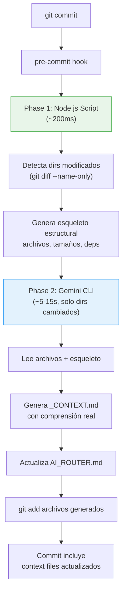

# JIT Context Assembly — Propuesta de Arquitectura

> **Versión**: 2.0 · **Fecha**: 2026-02-24  
> **Cambio principal**: Mapper híbrido (Node.js + Gemini CLI)

---

## El Problema

Cuando un agente IA trabaja en un codebase, enfrenta un dilema:
- **Indexar todo** → Token bloat, costo alto, degradación de calidad
- **Indexar poco** → El agente no encuentra lo que necesita

## La Solución: Just-In-Time Context Assembly

Separar el **mapeo** del codebase del **building**. Un mapper automatizado genera contexto rico en cada directorio. El agente builder solo lee lo que necesita, cuando lo necesita.

---

## Arquitectura: Mapper Híbrido



### Dos Fases del Mapper

| Fase | Motor | Tiempo | Qué hace |
|---|---|---|---|
| **1. Estructura** | Node.js script | ~200ms | Detecta cambios (git diff), lista archivos, tamaños, imports |
| **2. Inteligencia** | Gemini CLI | ~5-15s | Lee el código, entiende propósito, escribe descripciones ricas |

> [!IMPORTANT]
> Gemini CLI tiene quota separada del IDE. El costo es solo latencia (~5-15s por commit, solo para directorios modificados).

---

## Naming Convention

| Archivo | Ubicación | Propósito |
|---|---|---|
| `AI_ROUTER.md` | Raíz del proyecto | Punto de entrada maestro para agentes IA |
| `_CONTEXT.md` | En cada directorio con código | Describe contenido, propósito y relaciones |

> [!NOTE]
> `_CONTEXT.md` (no `README.md`) evita conflictos con el README del proyecto. El prefijo `_` lo posiciona al inicio del listado.

---

## Phase 1: Node.js Script (`scripts/map-context.mjs`)

Script liviano que orquesta el proceso. No necesita entender código, solo detectar cambios y preparar datos para Gemini CLI.

### Responsabilidades
1. Ejecutar `git diff --cached --name-only` para detectar qué archivos cambiaron
2. Agrupar cambios por directorio
3. Para cada directorio modificado, generar un **esqueleto estructural**:
   - Lista de archivos con extensión y tamaño
   - Imports detectados (regex: `import ... from '...'` / `require('...')`)
   - `_CONTEXT.md` existente (para preservar secciones `MANUAL`)
4. Pasar el esqueleto + contenido de archivos a Gemini CLI
5. Recibir output de Gemini CLI y escribir `_CONTEXT.md`
6. Regenerar `AI_ROUTER.md` (recopilando primera línea de cada `_CONTEXT.md`)

### Configuración (`scripts/map-context.config.mjs`)

```javascript
export default {
  // Directorios ignorados
  ignore: [
    'node_modules', '.next', '.git', '.agents',
    'coverage', 'dist', '.vercel', '.gemini'
  ],

  // Extensiones de código a procesar
  codeExtensions: ['.js', '.jsx', '.ts', '.tsx', '.mjs', '.css', '.sql'],

  // Profundidad máxima
  maxDepth: 5,

  // Archivos generados
  routerFile: 'AI_ROUTER.md',
  contextFile: '_CONTEXT.md',

  // Metadata del proyecto
  projectMeta: {
    name: 'Logística Internacional',
    stack: 'Next.js 14 (App Router) · Supabase (PostgreSQL) · Vercel',
  }
}
```

---

## Phase 2: Gemini CLI — Generación Inteligente

### Cómo se invoca

El script Node.js invoca Gemini CLI para cada directorio modificado:

```bash
# El script genera un prompt temporal y lo pasa a Gemini CLI
gemini -p "$(cat /tmp/map-prompt-src-lib-calculadora.txt)"
```

### Prompt Template

El script construye dinámicamente un prompt para cada directorio:

```markdown
Sos un documentador de código. Generá un archivo _CONTEXT.md para el 
directorio `src/lib/calculadora/` de un proyecto Next.js.

## Esqueleto estructural (generado automáticamente)
- engine.js (4.2 KB) — imports: ../constants, decimal.js
- defaults.js (1.1 KB) — imports: ninguno
- volumetric.js (0.8 KB) — imports: ../constants

## Contenido de los archivos
### engine.js
```js
[contenido completo del archivo]
```

### defaults.js
```js
[contenido completo del archivo]
```

### volumetric.js
```js
[contenido completo del archivo]
```

## Secciones manuales a preservar
<!-- MANUAL:START -->
[contenido existente si hay]
<!-- MANUAL:END -->

## Instrucciones
Generá SOLO el markdown del _CONTEXT.md con este formato exacto:

# 📁 [ruta del directorio]

## Propósito
[1-2 oraciones explicando qué hace este módulo]

## Archivos
| Archivo | Descripción |
|---|---|
[una fila por archivo con descripción funcional]

## Relaciones
- **Usa**: [qué módulos/archivos externos consume]
- **Usado por**: [qué módulos dependen de este]

## Detalles clave
[Bullets con lógica de negocio importante, patrones, advertencias]

[Preservar secciones MANUAL si existen]

No incluyas bloques de código. No inventes archivos que no existen.
Escribí en español.
```

### Output esperado de Gemini CLI

```markdown
# 📁 src/lib/calculadora

## Propósito
Motor de cálculo de costos de importación y volumetría. Procesa la matriz
de costos (CIF, tributos, impuestos, gastos operativos) con soporte para
campos dinámicos y doble salida (real vs cliente).

## Archivos
| Archivo | Descripción |
|---|---|
| `engine.js` | Lógica central: calcula CIF, base imponible, aplica tributos/impuestos sobre las bases correctas. Soporta items activos/inactivos y override de valores para salida cliente |
| `defaults.js` | Matriz default de conceptos de costo (flete, BAF, seguro, derechos 12.6%, tasa 3%, IVA 21%, etc.) con categoría, tipo y base de cálculo |
| `volumetric.js` | Dado un tamaño de caja y tipo de container, calcula cantidad máxima de cajas y valida peso |

## Relaciones
- **Usa**: `src/lib/constants.js` (tipos de container, estados)
- **Usado por**: `src/hooks/useCostCalculator.js`, `src/app/contenedores/[id]/costos/page.js`

## Detalles clave
- El engine es puro (sin side effects) — recibe inputs, devuelve resultados
- Las bases de cálculo son encadenadas: FOB → CIF → Base Imponible → Total
- La salida cliente permite override por campo (`client_value`, `client_active`, `client_label`)
- El volumétric no considera rotación de cajas (cálculo simple)
```

> [!TIP]
> Comparado con el output determinístico que solo listaría `engine.js (4.2 KB)`, el LLM entiende que engine.js "calcula CIF y aplica tributos sobre las bases correctas". Esto le permite al Builder navegar sin leer el archivo.

---

## AI_ROUTER.md — Estructura

Generado automáticamente recopilando el `## Propósito` de cada `_CONTEXT.md`:

```markdown
# 🧭 AI Router — Logística Internacional

> Punto de entrada para agentes IA. Leé este archivo primero.
> Auto-generado por `scripts/map-context.mjs` + Gemini CLI

## Proyecto
Sistema de gestión de logística internacional con 3 depósitos (HK, CH, USA).
Seguimiento de contenedores, clasificación de mercadería, cálculo de costos
de importación, dashboards operativos.

## Stack
Next.js 14 (App Router) · Supabase (PostgreSQL) · Vercel · ExcelJS

## Convenciones
- Componentes: PascalCase · Libs: camelCase · DB: snake_case · URLs: kebab-case
- Server Components por defecto, `'use client'` solo para interactividad
- Validación con Zod en server actions
- UI en español · Monedas: USD y ARS

## Mapa del Proyecto

| Directorio | Qué contiene | Contexto |
|---|---|---|
| `src/app/` | Rutas y páginas Next.js | [→ _CONTEXT.md](src/app/_CONTEXT.md) |
| `src/components/` | Componentes React | [→ _CONTEXT.md](src/components/_CONTEXT.md) |
| `src/lib/` | Lógica de negocio y utilidades | [→ _CONTEXT.md](src/lib/_CONTEXT.md) |
| `src/hooks/` | Custom React hooks | [→ _CONTEXT.md](src/hooks/_CONTEXT.md) |
| `supabase/` | Migraciones SQL y config DB | [→ _CONTEXT.md](supabase/_CONTEXT.md) |
| `scripts/` | Automatización (mapper, etc.) | [→ _CONTEXT.md](scripts/_CONTEXT.md) |
| `public/` | Assets estáticos | [→ _CONTEXT.md](public/_CONTEXT.md) |

## Documentación
- [Relevamiento funcional](docs/relevamiento_funcional.md)
- [Arquitectura](docs/arquitectura.md)
- [Plan de implementación](docs/implementation_plan.md)

## Cómo Navegar (para agentes)
1. Leé este archivo para entender el proyecto
2. Identificá qué directorio(s) son relevantes para tu tarea
3. Leé el `_CONTEXT.md` de esos directorios
4. Leé SOLO los archivos específicos que necesitás
5. Si creás archivos, no necesitás agregar anotaciones — el mapper se encarga
```

---

## Secciones Manuales Preservadas

Tanto en `_CONTEXT.md` como en `AI_ROUTER.md`, el contenido entre markers especiales **nunca se sobrescribe**:

```markdown
<!-- MANUAL:START -->
Nota del equipo: El cálculo de IIBB usa alícuota de CABA (3%).
Para clientes de provincia hay que ajustar manualmente.
<!-- MANUAL:END -->
```

El script Node.js extrae estas secciones antes de regenerar y las reinserta después.

---

## Git Hook Integration

### Setup

```json
// package.json (scripts relevantes)
{
  "scripts": {
    "map": "node scripts/map-context.mjs",
    "map:full": "node scripts/map-context.mjs --full",
    "prepare": "husky"
  }
}
```

```bash
# .husky/pre-commit
node scripts/map-context.mjs
git add "*/_CONTEXT.md" "AI_ROUTER.md"
```

### Modos de ejecución

| Comando | Qué hace |
|---|---|
| `npm run map` | Incremental: solo procesa directorios con cambios staged |
| `npm run map:full` | Completo: regenera todos los `_CONTEXT.md` y `AI_ROUTER.md` |
| `git commit` | Ejecuta `map` automáticamente via pre-commit hook |

### Fallback sin Gemini CLI

Si Gemini CLI no está disponible (ej: CI/CD, otra máquina), el script cae al modo determinístico: genera `_CONTEXT.md` con estructura básica (listado de archivos sin descripciones ricas). Esto garantiza que el hook no bloquea commits.

```javascript
// Dentro de map-context.mjs
try {
  contextContent = await generateWithGeminiCLI(dir, skeleton);
} catch (e) {
  console.warn(`⚠ Gemini CLI no disponible, usando fallback determinístico`);
  contextContent = generateDeterministic(dir, skeleton);
}
```

---

## Integración con Antigravity

### User Rules

Agregar al archivo de reglas del usuario:

```
Antes de iniciar cualquier tarea de código, leé AI_ROUTER.md en la raíz.
Usá los _CONTEXT.md para navegar el codebase sin indexar todo.
Navegá hop-by-hop: AI_ROUTER → _CONTEXT.md → archivos específicos.
```

### Workflow (`.agents/workflows/context-first.md`)

```markdown
---
description: Cómo navegar el codebase usando JIT Context
---
// turbo-all
1. Leer `AI_ROUTER.md` en la raíz del proyecto
2. Identificar directorios relevantes para la tarea
3. Leer los `_CONTEXT.md` de esos directorios
4. Leer solo los archivos específicos necesarios
5. Ejecutar la tarea
```

---

## Ejemplo: Navegación del Builder

**Tarea**: "Agregá un campo 'seguro adicional' a la calculadora de costos"

```
Paso 1: Lee AI_ROUTER.md (~0.5 KB)
  → Calculadora está en src/lib/calculadora/ y src/components/calculadora/

Paso 2: Lee src/lib/calculadora/_CONTEXT.md (~0.8 KB)
  → "defaults.js tiene la matriz default de conceptos de costo"
  → "engine.js es puro, recibe inputs y devuelve resultados"
  → Relaciones: usado por useCostCalculator.js

Paso 3: Lee src/components/calculadora/_CONTEXT.md (~0.6 KB)
  → "CostMatrix renderiza CostRows dinámicamente"
  → "La matriz es dinámica, los items se agregan/quitan"

Paso 4: Solo necesita leer defaults.js (~1.1 KB)
  → Agrega el nuevo concepto al array de defaults
  → engine.js ya lo soporta (es dinámico)
  → UI ya lo soporta (es dinámico)

Total leído: ~3 KB en vez de ~200 KB del workspace completo
Archivos leídos: 3 context + 1 código = 4 archivos
```

---

## Plan de Implementación

| Paso | Acción |
|---|---|
| 1 | Init Next.js + instalar Husky |
| 2 | Crear `scripts/map-context.config.mjs` |
| 3 | Crear `scripts/map-context.mjs` (Phase 1: estructural) |
| 4 | Integrar Gemini CLI en el script (Phase 2: inteligencia) |
| 5 | Crear `.husky/pre-commit` |
| 6 | Crear `.agents/workflows/context-first.md` |
| 7 | Ejecutar `npm run map:full` para generar contexto inicial |
| 8 | Verificar que el hook funciona en un commit real |
