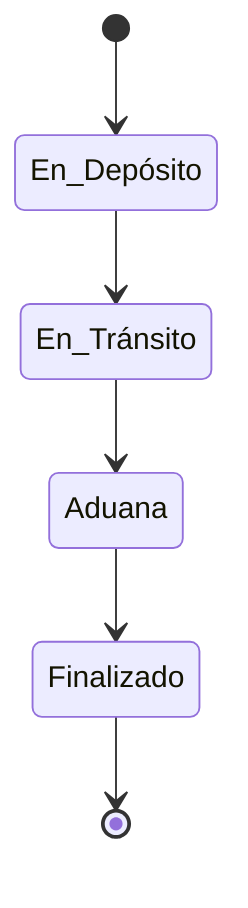
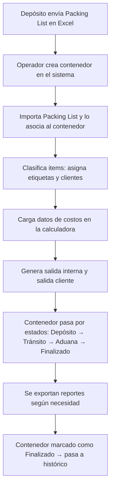
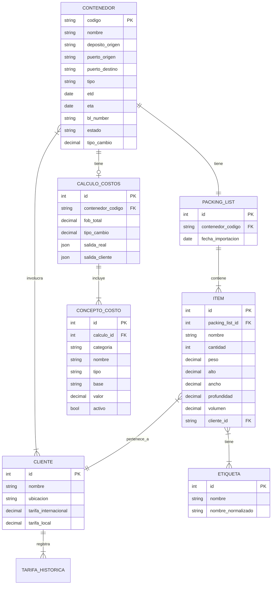

# Relevamiento Funcional — Sistema de Gestión de Logística Internacional

> **Versión**: 1.0 · **Fecha**: 2026-02-24  
> **Estado**: Borrador para revisión

---

## 1. Contexto y Objetivo

Sistema de gestión para operaciones de logística internacional con **3 depósitos** (Hong Kong, China, USA). La empresa recibe **Packing Lists** armados por operadores externos en los depósitos, sin control de stock ni registro de ingreso de paquetes.

**Objetivo**: Centralizar el seguimiento de contenedores, clasificar mercadería, calcular costos de importación y proveer visibilidad operativa a un equipo pequeño (1-3 personas) con conocimientos informáticos básicos.

### Restricciones
- El workflow actual no se modificará
- Los usuarios tienen experiencia básica en Excel/Sheets
- Se priorizará la simplicidad de uso sobre la optimización del proceso

---

## 2. Actores

| Actor | Descripción |
|---|---|
| **Operador** | Usuario principal. Carga datos, gestiona contenedores, asigna etiquetas, usa calculadoras |
| **Consultor** | Consulta dashboards y exporta reportes (puede ser el mismo operador) |
| **Depósitos (HK/CH/USA)** | Actores externos. Envían Packing Lists en formato Excel |

---

## 3. Módulos Funcionales

### 3.1 Gestión de Contenedores

Cada contenedor es la **unidad central** del sistema. Todo se organiza alrededor del contenedor.

#### Datos del contenedor
| Campo | Tipo | Notas |
|---|---|---|
| Código | Auto-generado | Formato a definir (ej: `HK-2026-001`) |
| Nombre | Texto libre | Nombre descriptivo asignado por el operador |
| Depósito de origen | Selección | HK, CH, USA |
| Puerto de origen | Texto | |
| Puerto de destino | Texto | |
| Tipo de contenedor | Selección | 20', 40', 40'HC |
| ETD | Fecha | Estimated Time of Departure |
| ETA | Fecha | Estimated Time of Arrival |
| BL Number | Texto | Opcional |
| Estado | Selección | Ver sección 3.6 |
| Tipo de cambio utilizado | Numérico | Registrado al momento de operar |

#### Estados del contenedor



> [!NOTE]
> El sistema debe contemplar la posibilidad de agregar estados intermedios en el futuro (ej: "Liberado de aduana", "En distribución"). Los cambios de estado son **manuales**.

---

### 3.2 Packing Lists

Relación **1:1** con contenedores. Se importan desde archivos Excel provenientes de los depósitos.

#### Campos del Packing List (por item)
| Campo | Tipo |
|---|---|
| Nombre / Descripción | Texto |
| Cantidad | Numérico |
| Peso (por unidad o total) | Numérico (kg) |
| Alto | Numérico (cm) |
| Ancho | Numérico (cm) |
| Profundidad | Numérico (cm) |
| Volumen | Numérico (calculado o importado) |

#### Funcionalidad de importación
- El usuario sube un archivo Excel
- El sistema parsea el contenido y lo muestra en formato tabular
- El usuario puede **mapear columnas** si el formato del Excel no es estándar
- Una vez importado, el packing list queda asociado al contenedor

#### Post-importación: Clasificación
- El usuario asigna **etiquetas** a items individuales o grupos de items
- El usuario asigna **clientes** a items individuales o grupos de items
- Un item puede tener múltiples etiquetas
- Un item generalmente pertenece a 1 cliente (excepcionalmente puede compartirse)

---

### 3.3 Gestión de Clientes

Los clientes se crean y agregan de forma orgánica conforme se necesiten.

#### Datos del cliente
| Campo | Obligatorio | Notas |
|---|---|---|
| Nombre | ✅ | |
| Ubicación | ❌ | |
| Tarifa internacional | ❌ | |
| Tarifa local | ❌ | |
| Histórico de tarifa | Auto | Se registra cada cambio |
| Histórico cantidad de items | Auto | Se calcula por contenedores asociados |
| Histórico volumétrico | Auto | Se calcula por contenedores asociados |

> [!TIP]
> La ficha de cliente debe ser expandible: campos opcionales que se pueden agregar sin romper el sistema.

#### Consulta de cliente
Al consultar un cliente, el sistema debe mostrar:
- Contenedores asociados (activos e históricos)
- Packing list por contenedor
- ETD / ETA por contenedor
- Volumen total por contenedor
- Costos asociados (si aplica)

---

### 3.4 Gestión de Etiquetas

Sistema de etiquetas libre con normalización.

#### Reglas
- Las etiquetas se crean libremente al clasificar items
- Existe un **registro maestro de etiquetas** para evitar duplicados (ej: "porcelanato" vs "Porcelanato" vs "porcelanatos")
- Al crear una etiqueta nueva, el sistema sugiere etiquetas existentes similares
- Un item puede tener múltiples etiquetas

#### Consulta por etiqueta
Al consultar una etiqueta, el sistema debe mostrar:
- Contenedores donde aparece
- Items asociados dentro de cada contenedor
- Clientes vinculados
- ETD / ETA de cada contenedor

---

### 3.5 Calculadora de Costos

Calculadora con **matriz de campos variable** y **doble salida** (interna y para cliente).

#### Entradas de la operación (inputs)

| Campo | Tipo | Moneda |
|---|---|---|
| Valor FOB Total | Numérico | USD |
| Flete Oceánico | Numérico | USD |
| BAF (Recargo Flete) | Numérico | USD |
| Seguro | Numérico (fijo) | USD |
| Tipo de Cambio (ARS/USD) | Numérico | — |

#### Estructura de costos (matriz)

La calculadora organiza los costos en **categorías**. Cada ítem puede ser activado/desactivado y su valor puede ser porcentual o fijo.

| Categoría | Concepto | Tipo | Base | Valor default |
|---|---|---|---|---|
| **1. Gastos al CIF** | Flete Oceánico | Fijo | Entrada | — |
| | BAF | Fijo | Entrada | — |
| | Seguro | Fijo | Entrada | — |
| **2. Tributos (s/CIF)** | Derechos | % | CIF | 12.6% |
| | Tasa Estadística | % | CIF | 3% |
| **3. Impuestos (s/Base)** | IVA | % | Base imponible | 21% |
| | Percepción IVA | % | Base imponible | 20% |
| | Percepción Ganancias | % | Base imponible | 6% |
| | Percepción IIBB | % | Base imponible | 3% |
| **4. Gastos Operativos** | Costos Agencia | Fijo | — | — |
| | IVA s/ Agencia | % | Costos Agencia | 10.5% |
| | Terminal Portuaria | Fijo | — | — |
| | Acarreo GBA | Fijo | — | — |
| | Honorarios Despacho | Fijo | — | — |
| | Gastos Despacho | Fijo | — | — |
| | Gastos Bancarios | Fijo | — | — |
| | Gastos Bancarios Ext. | Fijo | — | — |
| | Imp. Transf. | % | Total gastos locales | 1.2% |
| **5. Gastos Operativos Ext.** | Agentes exterior | Fijo | — | — |
| | Depósito ext. | Fijo | — | — |
| | Fee | Fijo | — | — |

#### Valores calculados intermedios

```
CIF = FOB + Flete Oceánico + BAF + Seguro
Base Imponible = CIF + Derechos + Tasa Estadística
Total Gastos Locales = Σ(Gastos Operativos categs. 4 y 5)
Costo Total = CIF + Tributos + Impuestos + Gastos Operativos
```

#### Doble salida

| Salida | Descripción |
|---|---|
| **Interna (real)** | Refleja los costos reales tal como se calculan |
| **Cliente** | El usuario puede: activar/desactivar ítems, modificar valores individuales, agregar ítems ficticios. Es una "copia editable" de la salida real |

#### Distribución por cliente
- `Costo cliente = (Volumen cliente / Volumen total contenedor) × Costo total`

> [!IMPORTANT]
> La estructura de la calculadora debe ser **dinámica**: el usuario debe poder agregar nuevas categorías y conceptos de costo sin intervención técnica.

---

### 3.6 Cálculo Volumétrico

Dado un tamaño de caja estándar, calcular cuántas cajas entran en un contenedor.

#### Inputs
| Campo | Descripción |
|---|---|
| Largo caja (cm) | |
| Ancho caja (cm) | |
| Alto caja (cm) | |
| Tipo de contenedor | 20', 40', 40'HC |

#### Dimensiones internas de contenedores (referencia)
| Tipo | Largo (cm) | Ancho (cm) | Alto (cm) | Peso máx. (kg) |
|---|---|---|---|---|
| 20' | 589 | 235 | 239 | 28,200 |
| 40' | 1,203 | 235 | 239 | 28,600 |
| 40'HC | 1,203 | 235 | 269 | 28,400 |

> [!NOTE]
> Estas medidas son aproximadas y podrían variar. El sistema debería permitir ajustar las dimensiones internas del contenedor.

#### Outputs
- Cantidad máxima de cajas (por volumen)
- Capacidad restante / % utilizado
- Validación de peso máximo (cajas × peso unitario vs. peso máx. del contenedor)

---

### 3.7 Tipo de Cambio

#### Fuente
- Se obtiene por API (dolarapi.com o similar)
- El usuario puede seleccionar qué tipo de dólar usar (oficial, blue, MEP, CCL, etc.)
- Tabla editable donde se visualizan los tipos disponibles

#### Registro
- Cuando se opera un contenedor, se registra el tipo de cambio utilizado en ese momento
- El historial queda asociado al contenedor

---

### 3.8 Dashboards

Tres vistas principales:

#### Dashboard General
- Contenedores activos por estado (gráfico)
- Próximos ETA (timeline o tabla)
- Alertas / eventos recientes
- Resumen volumétrico global

#### Dashboard Contenedores
- Lista de todos los contenedores (filtrable por estado, origen, fecha)
- Detalle rápido al seleccionar un contenedor
- Estado visual (ej: kanban o tabla con colores por estado)

#### Dashboard Clientes
- Lista de clientes con indicadores (contenedores activos, volumen total)
- Drill-down al seleccionar un cliente

---

### 3.9 Exportación

- Exportar datos **por contenedor**: Contenido, cantidad, cliente, etiquetas
- Exportar datos **por cliente**: Contenedores, contenido por contenedor, etiquetas
- **Formato**: Excel (.xlsx)

---

### 3.10 Registros Históricos

- Los contenedores **finalizados** pasan a un archivo histórico
- Toda la información se conserva: packing list, costos, etiquetas, clientes
- Se puede consultar y exportar igual que los datos activos
- Filtros por rango de fechas, cliente, etiqueta, depósito de origen

---

## 4. Flujo de Trabajo Principal



---

## 5. Modelo de Datos Conceptual



---

## 6. Decisiones Pendientes

| # | Tema | Opciones | Estado |
|---|---|---|---|
| 1 | **Plataforma** | Google Sheets + Apps Script / Web app / Híbrido | A definir |
| 2 | Formato código contenedor | `ORIGEN-AÑO-SEQ` vs otro | A definir |
| 3 | BL Number obligatorio | ¿Siempre se carga? | Opcional de momento |
| 4 | Estados adicionales | ¿Agregar más estados al flujo? | No prioritario |
| 5 | Cálculo volumétrico: orientaciones | ¿Considerar rotación de cajas? | A definir |
| 6 | API de dólar específica | dolarapi.com / otra | A definir |
| 7 | Permisos de usuario | ¿Roles diferenciados? | No prioritario |

---

## 7. Recomendación de Arquitectura

Dado el perfil de usuarios (conocimientos básicos Excel/Sheets), la escala (1-3 personas), y la complejidad funcional del sistema, se recomienda una **arquitectura híbrida**:

### Opción recomendada: Google Sheets + Web App ligera

| Componente | Plataforma | Justificación |
|---|---|---|
| **Base de datos / Tablas** | Google Sheets | Familiar para los usuarios, editable directamente, exportable |
| **Calculadoras** | Google Sheets | El usuario ya entiende fórmulas, puede auditar cálculos |
| **Importación de Packing Lists** | Web App (Apps Script) | Parseo de Excel requiere lógica que es frágil en Sheets puro |
| **Dashboards** | Web App (Apps Script) | Visualizaciones más ricas y responsivas |
| **Clasificación (etiquetas/clientes)** | Web App o Sheets con menú customizado | Interfaz más limpia para clasificar |
| **API Tipo de Cambio** | Apps Script (cron) | Fetch automático periódico |
| **Exportación** | Apps Script | Genera Excel formateado |

> [!IMPORTANT]
> Esta es una recomendación inicial. La decisión de plataforma debe considerarse con cuidado antes de avanzar a la fase de diseño técnico.

### Alternativa: Web App completa (Next.js/Vite + Supabase)
- **Pros**: UI más profesional, mejor experiencia, más escalable
- **Contras**: Requiere hosting, los usuarios no pueden "tocar" los datos directamente como en Sheets, curva de aprendizaje mayor
